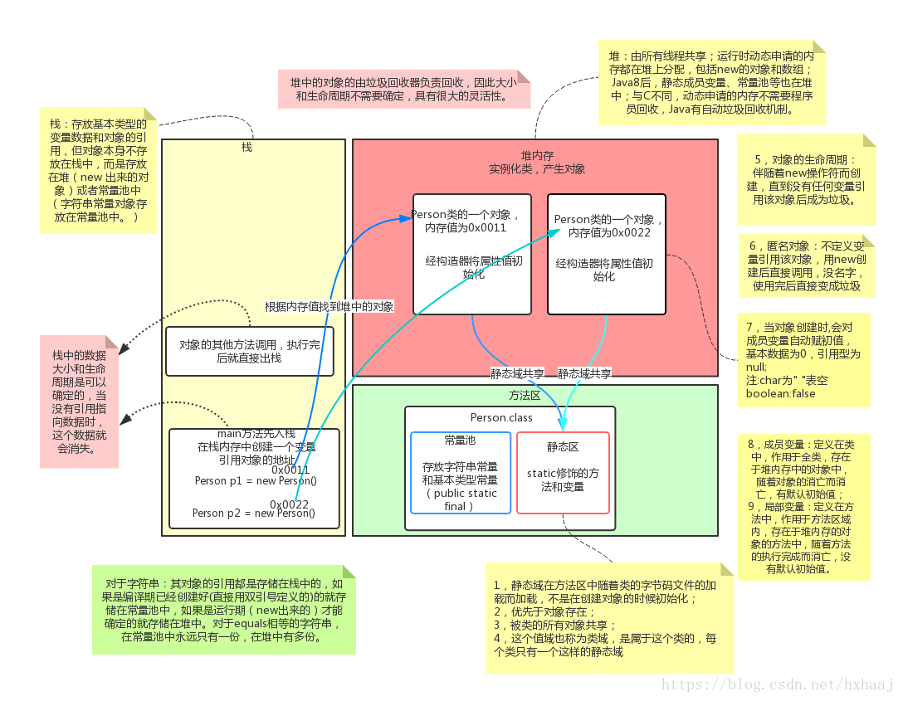

Java 面向对象 (二) 静态域、代码块和内存区域图
===========================
<!--more-->
静态域
---

*   将域定义成`static`后，每个`类`中`只有一个`这样的域，与类相关的，也称为`类成员`。但是每个`对象`对于`所有的实例域`却`都有自己的一份拷贝`。
*   `静态域`会`随着类的加载而加载并初始化`，存在于`方法区内存中`的`字节码文件的静态区域`中。
*   `优先于对象存在`，先有方法区的类加载，后才可能会有堆内存的对象实例化。
*   静态域会`被所有的对象共享`，也称为共享区。
*   一般`共性用静态`，特性用非静态。
*   一般通过`类名直接调用`，虽然`也可以`通过`对象名`调用，但是`不推荐`，也不合适。

### static 关键字注意事项

*   **在静态方法中没有 this 关键字**
    *   静态是随着类的加载而初始化，而`this`是`随着对象的创建而存在`的。
    *   静态比对象优先存在。
*   **静态方法只能访问静态成员和静态成员方法，即`静态只能访问静态`**
    *   静态方法：
        *   成员变量：只能访问静态变量
        *   成员方法：只能访问静态成员方法
    *   非静态方法：
        *   成员变量：`可以`是静态的，`也可以`是非静态的
        *   成员方法：可以是静态的成员方法，也可以是非静态的成员方法。

### 静态变量和成员变量区别

*   静态变量也叫类变量，成员变量也叫对象变量。
*   所属不同
    *   `静态`变量属于`类`
    *   `成员`变量属于`对象`
*   内存中的位置不同：
    *   静态变量存储于`方法区的静态区`
    *   成员变量存储于`堆内存`

代码块
---

### 代码块概述

*   Java 中，使用`{}括起来的代码`称为代码块

### 代码块的分类

*   根据位置和声明的不同，可以分为局部代码块，构造代码块，静态代码块和同步代码块

### 代码块的应用

*   `局部代码块`
    *   在`方法中`出现，可以`限定变量的生命周期，及早释放，提高内存利用率`。
*   `构造代码块`（初始化代码块）
    *   在类中`方法外`出现，将多个构造器中的相同代码放到一起，`每次调用构造器都执行，并且在构造方法前执行`。
*   `静态代码块`
    *   在类中`方法外`出现，并且用`static`修饰，用于给代码块中的代码静态化，`加入静态域中，在类加载的时候直接执行，并且只执行一次。`
    *   静态代码块`优先于main`方法执行。
    *   一般常用于`加载驱动`、`IO操作`等消耗资源的代码

### 代码块面试题

根据程序写输出结果，考察执行顺序

测试结果：

**分析：**

​ main 方法是 Java 程序的入口，JVM 先找 main 方法，先把有 main 方法的类加载到内存中，此时 StudentTest 类的静态代码块直接随着类的加载而先执行；

​ 随后 main 方法开始执行，当 Student 类被实例化后，Student 类的静态代码块先执行，并且只执行一个，不管实例化多少对象；

​ 之后，每实例化一次 Student 类，类中的构造代码块比构造方法就会先执行，并且每实例化一次就执行一次。

### 初始化执行顺序总结

*   当程序执行时，如果需要创建某个类的对象，那么 Java 会`先检查是否加载`了这个类，**如果没有加载，则先执行类的加载再生成对象**。如果已经加载，则直接生成对象。
*   类的执行顺序过程：
    *   首先类先加载到方法区内存中，类的静态域会先被加载并且初始化并且优先于 main 方法执行。Java 中类的加载时按需加载，需要时才加载，并且只加载一次。
        *   静态成员变量和静态代码块的执行顺序同代码中的顺序一致。
    *   每创建一次对象时，先初始化对象中的成员变量，再执行构造代码块，其次再执行构造方法。
        *   类中的变量会在任何方法（包括构造器）调用之前得到初始化，即使变量散布于方法定义之间。

Java 内存区域分配
-----------

*   此分配图基于 Java8 之前版本

