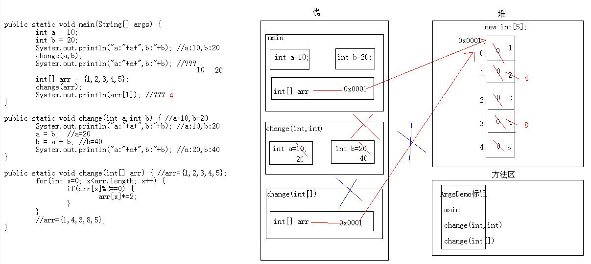

Java 程序运行时，需要在内存中分配空间。为了提高运算效率，就对空间进行了不同区域的划分，因为每一片区域都有特定的处理数据方式和内存管理方式。
<!--more-->
一、栈：储存局部变量

*   局部变量：在方法的定义中或者在方法声明上的变量称为局部变量。
*   特点：栈内存的数据用完就释放。

二、堆：储存 new 出来的东西

*   特点：
    *   每一个 new 出来的东西都有地址值；
    *   每个变量都有默认值 （byte, short, int, long 的默认值为 0；float, double 的默认值为 0.0；char 的默认值为 “\u0000”；boolean 的默认值为 false；引用类型为 null）；
    *   使用完毕就变成垃圾，但是并没有立即回收。会有垃圾回收器空闲的时候回收。

三、方法区：

一个对象的运行过程：

1.  **程序从 main 方法中进入；运行到 Phone p 时，在栈中开辟了一个空间；**
2.  **new Phone() 时，在队中开了一个内存空间，此时会有一个内存值为 0x0001；此时会找到对应的 Phone 的 class 文件，发现有三个变量和三个方法，于是将三个成员变量放在了堆中，但是此时的值为默认值（具体默认值见上）。注意，在方法区里也有一个地址值，假设为 0x001，可以认为在堆中也有一个位置，在堆中的位置，可以找到方法区中相对应的方法；**
3.  **继续运行，p.brand = "三星"；将三星赋值给 p.brand，通过栈中的 p 找到了堆中的 brand，此时的 null 值变为 “三星”。剩下的类似；**
4.  **当运行到 p.call("乔布斯") 时，通过栈中的 p 找到堆中存在的方法区的内存地址，从而指引到方法区中的 Phone.class 中的方法。从而将 call 方法加载到栈内存中，注意：当执行完毕后，call 方法就从栈内存中消失！剩余的如上。**
5.  **最后，main 方法消失！**

**两个对象的运行过程：**

1.  **程序从 main() 方法进入，运行到 Phone p 时，栈内存中开内存空间；**
2.  **new Phone() 时，在队中开了一个内存空间，内存值为 0x0001；此时会找到对应的 Phone 类，发现有三个变量，于是将三个成员变量放在了堆中，但是此时的值为默认值。又发现该类还存在方法，于是将该方法的内存值留在了堆中，在方法区里也有一个地址值，假设为 0x001，这个值与堆中的值相对应；**
3.  **程序继续运行，到 p.brand 时，进行了负值，同上；**
4.  **当程序运行到 Phone p2 时；到 new Phone() 时，在堆内存中开辟了内存空间 0x0002，赋值给 Phone p2；**
5.  **剩下跟一个对象的内存相同。**

 

**三个对象的运行过程：**

1.  **基本流程跟前两个无差别；**
2.  **但是当运行到 Phone p3 时，在栈内存中分配了一个空间，然后将 p1 的内存赋值给了 p3，即此时 Phone p3 的内存是指向 0x0001 的；**
3.  **继续给变量赋值，会将原来已经赋值的变量给替换掉。**

