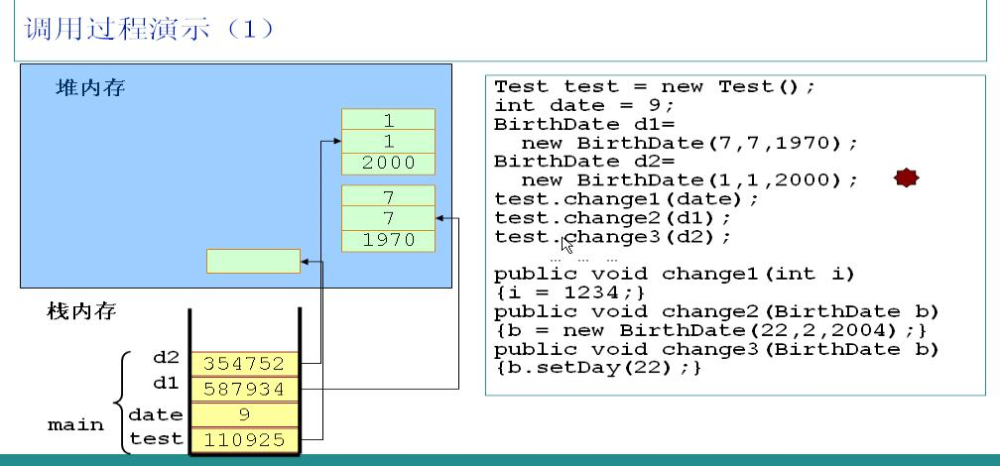
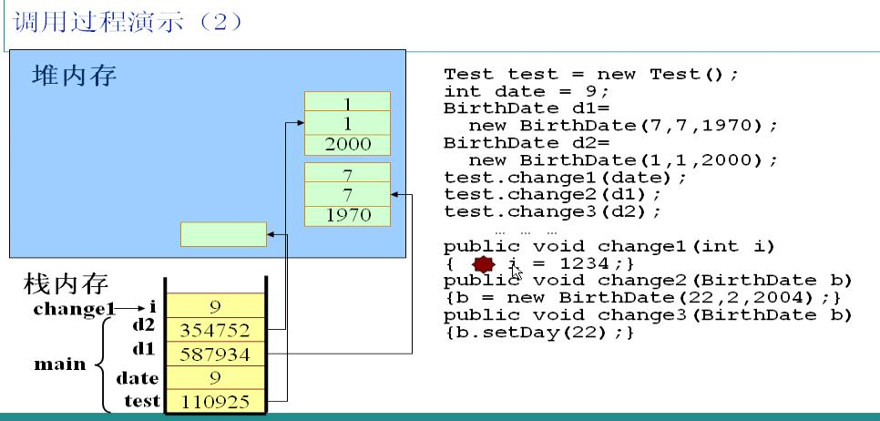
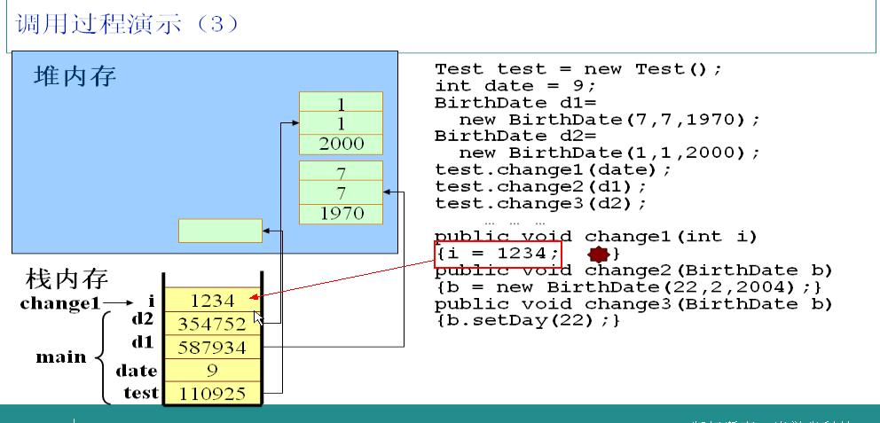
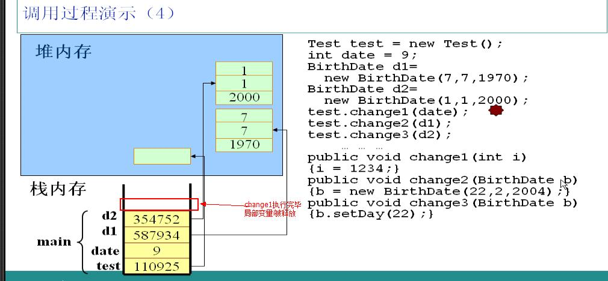
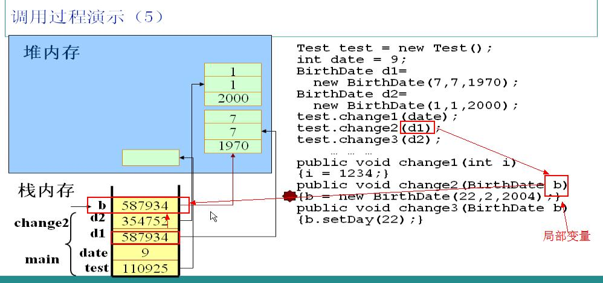
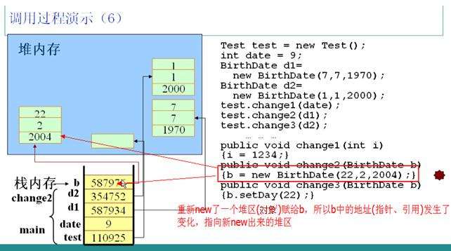
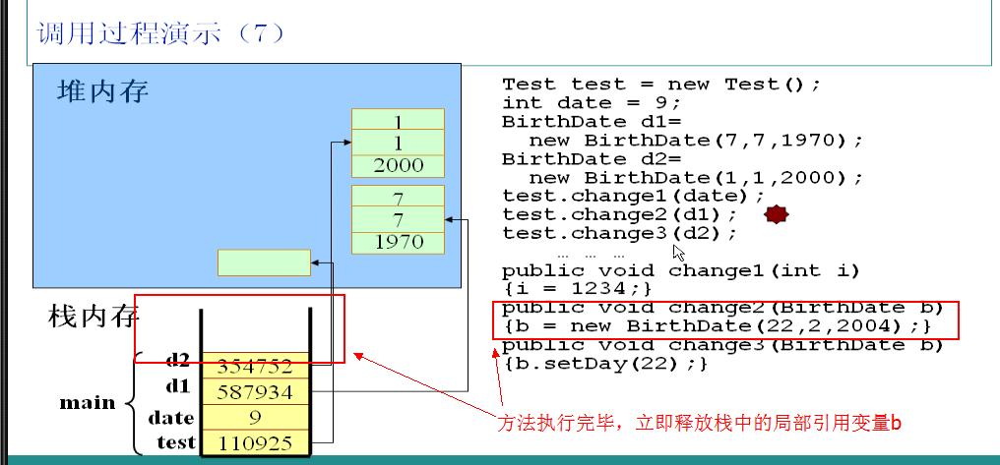
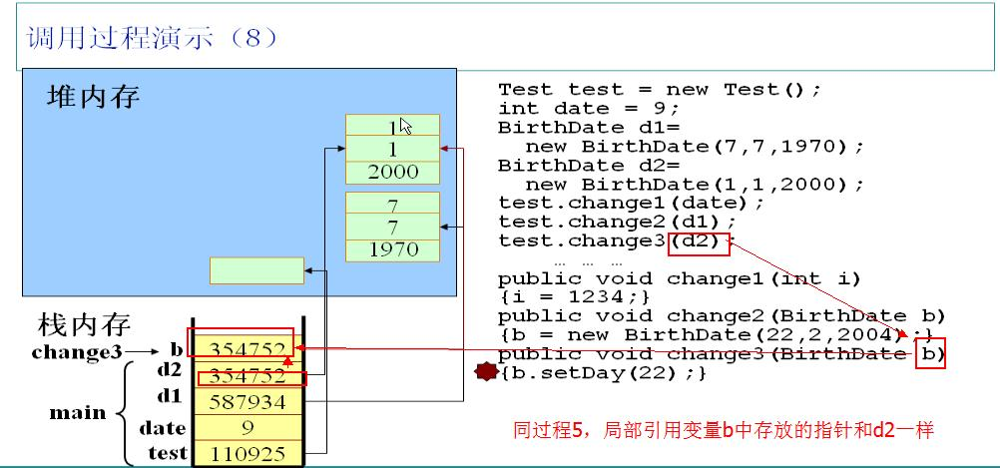
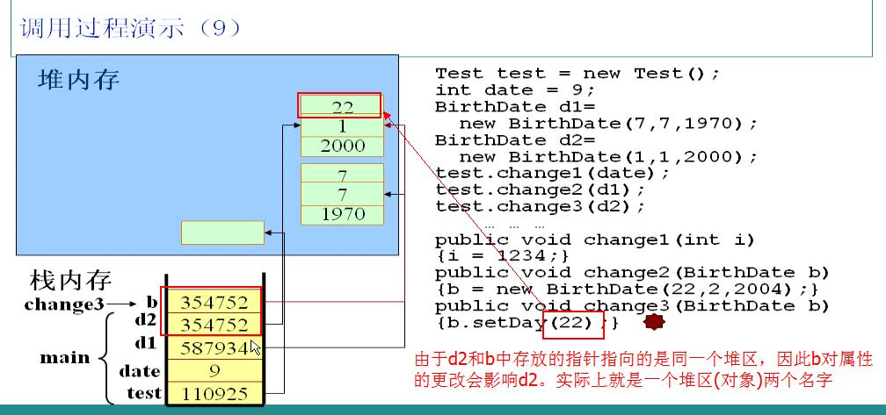
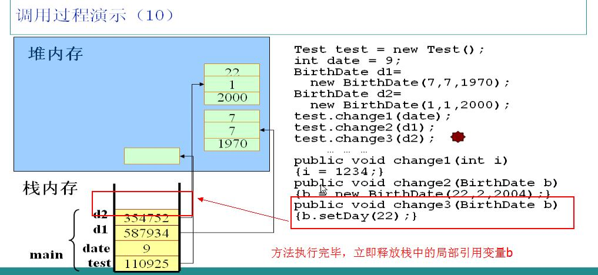

进入正题前首先要知道的是 Java 程序运行在 JVM(Java Virtual Machine，Java 虚拟机) 上，可以把 JVM 理解成 Java 程序和操作系统之间的桥梁，JVM 实现了 Java 的平台无关性，由此可见 JVM 的重要性。所以在学习 Java 内存分配原理的时候一定要牢记这一切都是在 JVM 中进行的，JVM 是内存分配原理的基础与前提。
<!--more-->
**简单通俗的讲，一个完整的 Java 程序运行过程会涉及以下内存区域：**

l **寄存器：**JVM 内部虚拟寄存器，存取速度非常快，程序不可控制。

l **栈：**保存局部变量的值，包括：1. 用来保存基本数据类型的值；2. 保存类的**实例**，即堆区**对象**的引用 (指针)。也可以用来保存加载方法时的帧。

l **堆：**用来存放动态产生的数据，比如 new 出来的**对象**。注意创建出来的对象只包含属于各自的成员变量，并不包括成员方法。因为同一个类的对象拥有各自的成员变量，存储在各自的堆中，但是他们共享该类的方法，并不是每创建一个对象就把成员方法复制一次。

l **常量池：**JVM 为每个已加载的类型维护一个常量池，常量池就是这个类型用到的常量的一个有序集合。包括直接常量 (基本类型，String) 和对其他类型、方法、字段的**符号引用 (1)**。池中的数据和数组一样通过索引访问。由于常量池包含了一个类型所有的对其他类型、方法、字段的符号引用，所以常量池在 Java 的动态链接中起了核心作用。**常量池存在于堆中**。

l **代码段：**用来存放从硬盘上读取的源程序代码。

l **数据段：**用来存放 static 定义的静态成员。

**下面是内存表示图：**


上图中大致描述了 Java 内存分配，接下来通过实例详细讲解 Java 程序是如何在内存中运行的（注：以下图片引用自尚学堂马士兵老师的 J2SE 课件，图右侧是程序代码，左侧是内存分配示意图，我会一一加上注释）。

**预备知识：**

**1.** 一个 Java 文件，只要有 main 入口方法，我们就认为这是一个 Java 程序，可以单独编译运行。

**2.** 无论是普通类型的变量还是引用类型的变量 (俗称实例)，都可以作为局部变量，他们都可以出现在栈中。只不过普通类型的变量在栈中直接保存它所对应的值，而引用类型的变量保存的是一个指向堆区的指针，通过这个指针，就可以找到这个实例在堆区对应的对象。因此，普通类型变量只在栈区占用一块内存，而引用类型变量要在栈区和堆区各占一块内存。

**示例：**



**1.**JVM 自动寻找 main 方法，执行第一句代码，创建一个 Test 类的实例，在栈中分配一块内存，存放一个指向堆区对象的指针 110925。

**2.** 创建一个 int 型的变量 date，由于是基本类型，直接在栈中存放 date 对应的值 9。

**3.** 创建两个 BirthDate 类的实例 d1、d2，在栈中分别存放了对应的指针指向各自的对象。他们在实例化时调用了有参数的构造方法，因此对象中有自定义初始值。



调用 test 对象的 change1 方法，并且以 date 为参数。JVM 读到这段代码时，检测到 i 是局部变量，因此会把 i 放在栈中，并且把 date 的值赋给 i。

  

把 1234 赋给 i。很简单的一步。

  

change1 方法执行完毕，立即释放局部变量 i 所占用的栈空间。




调用 test 对象的 change2 方法，以实例 d1 为参数。JVM 检测到 change2 方法中的 b 参数为局部变量，立即加入到栈中，由于是引用类型的变量，所以 b 中保存的是 d1 中的指针，此时 b 和 d1 指向同一个堆中的对象。在 b 和 d1 之间传递是指针。




change2 方法中又实例化了一个 BirthDate 对象，并且赋给 b。在内部执行过程是：在堆区 new 了一个对象，并且把该对象的指针保存在栈中的 b 对应空间，此时实例 b 不再指向实例 d1 所指向的对象，但是实例 d1 所指向的对象并无变化，这样无法对 d1 造成任何影响。



change2 方法执行完毕，立即释放局部引用变量 b 所占的栈空间，注意只是释放了栈空间，堆空间要等待自动回收。



调用 test 实例的 change3 方法，以实例 d2 为参数。同理，JVM 会在栈中为局部引用变量 b 分配空间，并且把 d2 中的指针存放在 b 中，此时 d2 和 b 指向同一个对象。再调用实例 b 的 setDay 方法，其实就是调用 d2 指向的对象的 setDay 方法。



调用实例 b 的 setDay 方法会影响 d2，因为二者指向的是同一个对象。



change3 方法执行完毕，立即释放局部引用变量 b。

以上就是 Java 程序运行时内存分配的大致情况。其实也没什么，掌握了思想就很简单了。无非就是两种类型的变量：基本类型和引用类型。二者作为局部变量，都放在栈中，基本类型直接在栈中保存值，引用类型只保存一个指向堆区的指针，真正的对象在堆里。作为参数时基本类型就直接传值，引用类型传指针。

**小结：**

**1.** 分清什么是实例什么是对象。Class a= new Class(); 此时 a 叫实例，而不能说 a 是对象。实例在栈中，对象在堆中，操作实例实际上是通过实例的指针间接操作对象。多个实例可以指向同一个对象。

**2.** 栈中的数据和堆中的数据销毁并不是同步的。方法一旦结束，栈中的局部变量立即销毁，但是堆中对象不一定销毁。因为可能有其他变量也指向了这个对象，直到栈中没有变量指向堆中的对象时，它才销毁，而且还不是马上销毁，要等垃圾回收扫描时才可以被销毁。

**3.** 以上的栈、堆、代码段、数据段等等都是相对于应用程序而言的。每一个应用程序都对应唯一的一个 JVM 实例，每一个 JVM 实例都有自己的内存区域，互不影响。并且这些内存区域是所有线程共享的。这里提到的栈和堆都是整体上的概念，这些堆栈还可以细分。

**4.** 类的成员变量在不同对象中各不相同，都有自己的存储空间 (成员变量在堆中的对象中)。而类的方法却是该类的所有对象共享的，只有一套，对象使用方法的时候方法才被压入栈，方法不使用则不占用内存。

以上分析只涉及了栈和堆，还有一个非常重要的内存区域：常量池，这个地方往往出现一些莫名其妙的问题。常量池是干嘛的上边已经说明了，也没必要理解多么深刻，只要记住它维护了一个已加载类的常量就可以了。接下来结合一些例子说明常量池的特性。

**预备知识：**

基本类型和基本类型的包装类。基本类型有：byte、short、char、int、long、boolean。基本类型的包装类分别是：Byte、Short、Character、Integer、Long、Boolean。注意区分大小写。二者的区别是：基本类型体现在程序中是普通变量，基本类型的包装类是类，体现在程序中是引用变量。因此二者在内存中的存储位置不同：基本类型存储在栈中，而基本类型包装类存储在堆中。上边提到的这些包装类都实现了常量池技术，另外两种浮点数类型的包装类则没有实现。另外，String 类型也实现了常量池技术。


**实例：**

```
public class test {
    public static void main(String[] args) {    
        objPoolTest();
    }

    public static void objPoolTest() {
        int i = 40;
        int i0 = 40;
        Integer i1 = 40;
        Integer i2 = 40;
        Integer i3 = 0;
        Integer i4 = new Integer(40);
        Integer i5 = new Integer(40);
        Integer i6 = new Integer(0);
        Double d1=1.0;
        Double d2=1.0;

        System.out.println("i=i0\t" + (i == i0));
        System.out.println("i1=i2\t" + (i1 == i2));
        System.out.println("i1=i2+i3\t" + (i1 == i2 + i3));
        System.out.println("i4=i5\t" + (i4 == i5));
        System.out.println("i4=i5+i6\t" + (i4 == i5 + i6));    
        System.out.println("d1=d2\t" + (d1==d2));

        System.out.println();        
    }
}
```

**结果：**

```
i=i0    true
i1=i2   true
i1=i2+i3        true
i4=i5   false
i4=i5+i6        true
d1=d2   false
```

**结果**分析**：**

**1.**i 和 i0 均是普通类型 (int) 的变量，所以数据直接存储在栈中，而栈有一个很重要的特性：**栈中的数据可以共享**。当我们定义了 int i = 40;，再定义 int i0 = 40; 这时候会自动检查栈中是否有 40 这个数据，如果有，i0 会直接指向 i 的 40，不会再添加一个新的 40。

**2.**i1 和 i2 均是引用类型，在栈中存储指针，因为 Integer 是包装类。由于 Integer 包装类实现了常量池技术，因此 i1、i2 的 40 均是从常量池中获取的，均指向同一个地址，因此 i1=12。

**3.** 很明显这是一个加法运算，**Java 的数学运算都是在栈中进行的**，**Java 会自动对 i1、i2 进行拆箱操作转化成整型**，因此 i1 在数值上等于 i2+i3。

**4.i**4 和 i5 均是引用类型，在栈中存储指针，因为 Integer 是包装类。但是由于他们各自都是 new 出来的，因此不再从常量池寻找数据，而是从堆中各自 new 一个对象，然后各自保存指向对象的指针，所以 i4 和 i5 不相等，因为他们所存指针不同，所指向对象不同。

**5.** 这也是一个加法运算，和 3 同理。

**6.**d1 和 d2 均是引用类型，在栈中存储指针，因为 Double 是包装类。但 Double 包装类没有实现常量池技术，因此 Doubled1=1.0; 相当于 Double d1=new Double(1.0);，是从堆 new 一个对象，d2 同理。因此 d1 和 d2 存放的指针不同，指向的对象不同，所以不相等。

**小结：**

**1.** 以上提到的几种基本类型包装类均实现了常量池技术，但他们维护的常量仅仅是【-128 至 127】这个范围内的常量，如果常量值超过这个范围，就会从堆中创建对象，不再从常量池中取。比如，把上边例子改成 Integer i1 = 400; Integer i2 = 400;，很明显超过了 127，无法从常量池获取常量，就要从堆中 new 新的 Integer 对象，这时 i1 和 i2 就不相等了。

**2.**String 类型也实现了常量池技术，但是稍微有点不同。String 型是先检测常量池中有没有对应字符串，如果有，则取出来；如果没有，则把当前的添加进去。

凡是涉及内存原理，一般都是博大精深的领域，切勿听信一家之言，多读些文章。我在这只是浅析，里边还有很多猫腻，就留给读者探索思考了。希望本文能对大家有所帮助！

**脚注：**

**(1)** 符号引用，顾名思义，就是一个符号，符号引用被使用的时候，才会解析这个符号。如果熟悉 linux 或 unix 系统的，可以把这个符号引用看作一个文件的软链接，当使用这个软连接的时候，才会真正解析它，展开它找到实际的文件

对于符号引用，在类加载层面上讨论比较多，源码级别只是一个形式上的讨论。

当一个类被加载时，该类所用到的别的类的符号引用都会保存在常量池，实际代码执行的时候，首次遇到某个别的类时，JVM 会对常量池的该类的符号引用展开，转为直接引用，这样下次再遇到同样的类型时，JVM 就不再解析，而直接使用这个已经被解析过的直接引用。

除了上述的类加载过程的符号引用说法，对于源码级别来说，就是依照引用的解析过程来区别代码中某些数据属于符号引用还是直接引用，如，System.out.println("test" +"abc");// 这里发生的效果相当于直接引用，而假设某个 Strings = "abc"; System.out.println("test" + s);// 这里的发生的效果相当于符号引用，即把 s 展开解析，也就相当于 s 是 "abc" 的一个符号链接，也就是说在编译的时候，class 文件并没有直接展看 s，而把这个 s 看作一个符号，在实际的代码执行时，才会展开这个。


转载链接： [http://blog.csdn.net/shimiso](http://blog.csdn.net/shimiso)
