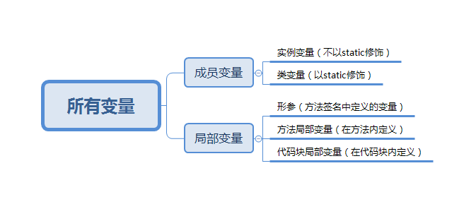
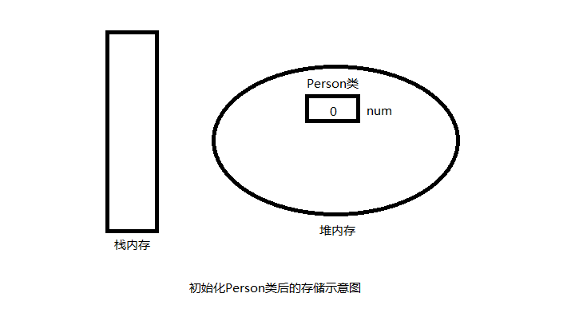
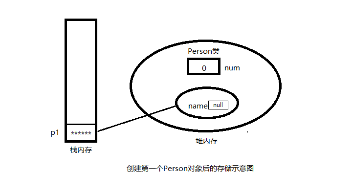
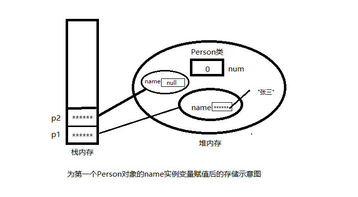

### 局部变量和成员变量的区别：
<!--more-->
**1. 定义的位置不一样【重点】**

*   局部变量：在方法的内部
*   成员变量：在方法的外部，直接写在类当中

**2. 作用范围不一样【重点】**

*   局部变量：只有方法当中才可以使用，出了方法就不能再用了
*   成员变量：整个类都可以通用

**3. 默认值不一样【重点】**

*   局部变量：没有默认值，如果要想使用，必须手动进行赋值
*   成员变量：如果没有赋值，会有默认值，规则和数组一样

4. 内存的位置不一样（了解）

*   局部变量：位于栈内存
*   成员变量：位于堆内存

5. 生命周期不一样（了解）

*   局部变量：随着方法进栈而诞生，随着方法出栈而消失
*   成员变量：随着对象的创建而诞生，随着对象被垃而消失

---
### 成员变量和局部变量
**1、成员变量和局部变量简述**

在 Java 语言里，根据定义变量位置的不同，可以将变量分成两大类：成员变量 (**存在于堆内存中，和类一起创建**) 和局部变量 (**存在于栈内存中，当方法执行完成，让出内存，让其他方法来使用内存**)。二者的运行机制存在较大差异。



**1.1 成员变量**

类变量从该类的准备阶段起开始存在，直到系统完全销毁这个类，类变量的作用域与这个类的生存范围相同；

而实例变量则从该类的实例被创建起开始存在，直到系统完全销毁这个实例，实例变量的作用域与对应实例的生存范围相同。

正是基于这个原因，可以把类变量和实例变量统称为成员变量。其中类变量可以理解为类成员变量，它作为类本身的一个成员，与类本身共存亡；实例变量则可以理解为实例成员变量，它作为实例的一个成员与实例共存亡。

只要类存在，类就可以访问类变量         类. 类变量

只要实例存在，实例就可以访问实例变量        实例. 实例变量

当然实例也可以访问类变量。但是需要注意的是因为实例不拥有类变量，所以通过实例来访问类变量进行操作，实际上是对类变量进行操作 ，当有其他实例来访问类变量时，访问的类变量是被对象访问操作过的类变量。

成员变量无需显示初始化，只要为一个类定义了类变量或实例变量，系统就会在这个类的准备阶段或创建该类的实例时进行默认初始化。

**1.2 局部变量**

局部变量根据定义形式的不同，又可以分为如下三种：

形参：在定义方法签名时定义的变量，形参的作用域在整个方法中都有效

方法局部变量：在方法体内定义的局部变量，它的作用域是从定义该变量的地方生效，到该方法结束时失效

代码块局部变量：这个局部变量的作用域从定义该变量的地方生效，到该代码结束时失效。

一个变量只在一对 {} 中起作用。。

java 允许局部变量和成员变量同名，如果方法中局部变量和成员变量同名，局部变量就会覆盖成员变量，如果需要在这个方法中引用被覆盖成员变量，则可使用 this（对于实例变量）或类名（对于类变量）作为调用者来限定访问成员变量。

**2、成员变量的初始化和内存中的运行机制**

接下来以下面代码来举例说明成员变量的初始化和内存中的运行机制


```
1 public class Person {
 2     public int num;
 3     public String name;
 5     public static void main(String[] args) {
 6         Person p1 = new Person();
 7         Person p2 = new Person();
 8         p1.num = 2;
 9         p2.num = 3;
10         p1.name = "张三";
11         p2.name = "李四";
12     }
15 }
```


当程序执行 Person p1 = new Person(); 时，如果这行代码是第一次使用 Person 类，则系统通常会在第一次使用 Person 类时加载这个类，并初始化这个类，在类的准备 阶段，系统将会为该类的类变量分配内存空间，并指定默认初始值。当 person 类初始化完成后，系统内存中的存储示意图如下图所示。



 可以看出，当 person 类初始化完成后，系统将在堆内存中为 Person 分配一块内存空间，实际上是创建了一个类对象，在这块内存区里包含了保存 num 类变量的内存，并设置 num 的默认初始值为 0。

系统接着创建了一个 Person 对象，并把这个 Person 对象赋给 p1 变量，Person 对象包含了名为 name 的实例变量，实例变量是在创建实例时分配内存空间并指定初始值的。当创建了第一个 person 对象后，系统内存中的存储示意图如下图所示。



从上图可以看出 num 不属于对象，它属于类，所以创建第一个对象时并不需要为 num 分配内存空间，系统只是为 name 分配了内存空间，并指定初始值为 null。

创建第二个对象 p2 时，由于在创建第一个对象时已经对类进行了初始化，所以在创建 p2 时对类进行初始化，对象的创建过程与第一个对象的创建过程没有什么区别。



第二个对象创建完成后，成员变量如上图所示在内存中存储。

** 当程序需要访问类变量时，尽量使用类来作为主调，不要使用对象作为主调，这个可以避免产生歧义。

3、局部变量的初始化和内存中的运行机制

* 局部变量必须经过显示初始化之后才能使用，系统不会为局部变量执行初始化。定义了局部变量以后，系统并没有给局部变量进行初始化，直到程序给这个局部变量赋给初值时，系统才会为这个局部变量分配内存空间，并将初始值保存到这块内存中。

* 局部变量不属于任何类或者实例，因此它总是保存在方法的栈内存中。如果局部变量是基本数据类型，则该变量直接存储在方法的栈内存中，如果是引用变量则将引用的地址存储在方法的栈内存中。

* 栈内存中的变量无需系统垃圾回收，随着方法或者代码块的运行结束而结束。局部变量通常只保存了具体的值或者引用地址，所以所占的内存比较小。

**4、变量的使用规则**

能不使用成员变量就别使用成员变量

能不使用方法局部变量就别使用方法局部变量

使用代码块局部变量性能最好。
