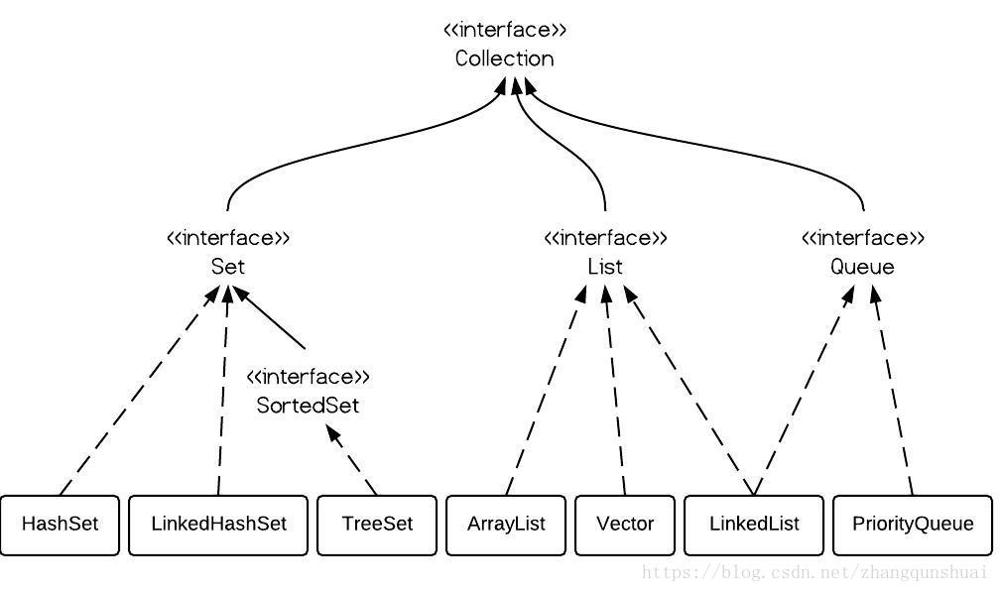
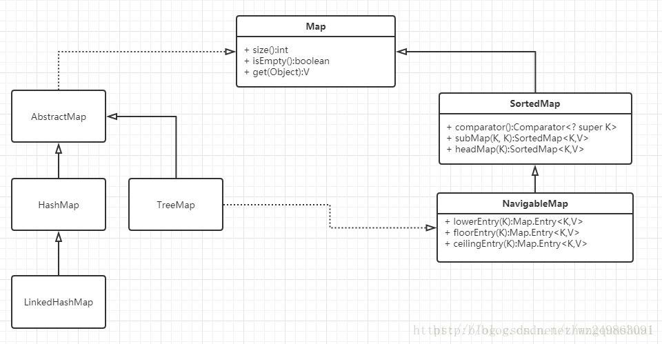
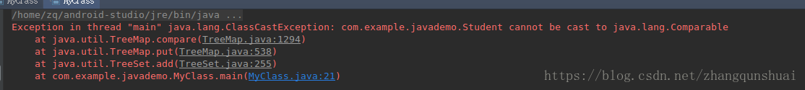
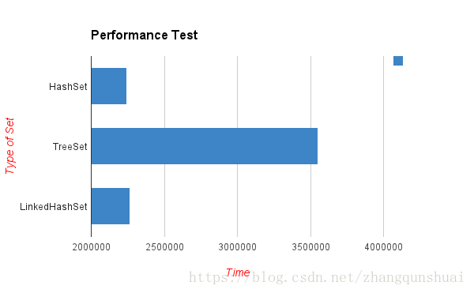

### Java集合中List,Set以及Map等集合体系详解[转]
<!--more-->
转载地址:[Java 集合中 List,Set 以及 Map 等集合体系详解 (史上最全)](https://blog.csdn.net/zhangqunshuai/article/details/80660974)
---------------------------------------------------------------------------------------------------------------

概述:
---

*   List , Set, Map 都是接口，前两个继承至 Collection 接口，Map 为独立接口
*   Set 下有 HashSet，LinkedHashSet，TreeSet
*   List 下有 ArrayList，Vector，LinkedList
*   Map 下有 Hashtable，LinkedHashMap，HashMap，TreeMap
*   Collection 接口下还有个 Queue 接口，有 PriorityQueue 类



注意:
---

*   Queue 接口与 List、Set 同一级别，都是继承了 Collection 接口。  
    看图你会发现, LinkedList 既可以实现 Queue 接口, 也可以实现 List 接口. 只不过呢, LinkedList 实现了 Queue 接口。Queue 接口窄化了对 LinkedList 的方法的访问权限（即在方法中的参数类型如果是 Queue 时，就完全只能访问 Queue 接口所定义的方法 了，而不能直接访问 LinkedList 的非 Queue 的方法），以使得只有恰当的方法才可以使用。

*   SortedSet 是个接口，它里面的（只有 TreeSet 这一个实现可用）中的元素一定是有序的。


总结:
---

### Connection 接口:

— **List 有序, 可重复**

*   ArrayList  
    **优点:** 底层数据结构是数组，查询快，增删慢。  
    **缺点:** 线程不安全，效率高
*   Vector  
    **优点:** 底层数据结构是数组，查询快，增删慢。  
    **缺点:** 线程安全，效率低
*   LinkedList  
    **优点:** 底层数据结构是链表，查询慢，增删快。  
    **缺点:** 线程不安全，效率高

—**Set 无序, 唯一**

*   HashSet  
    底层数据结构是哈希表。(无序, 唯一)  
    如何来保证元素唯一性?  
    1. 依赖两个方法：hashCode() 和 equals()

*   LinkedHashSet  
    底层数据结构是链表和哈希表。(FIFO 插入有序, 唯一)  
    1. 由链表保证元素有序  
    2. 由哈希表保证元素唯一

*   TreeSet  
    底层数据结构是红黑树。(唯一，有序)  
    1. 如何保证元素排序的呢?  
    自然排序  
    比较器排序  
    2. 如何保证元素唯一性的呢?  
    根据比较的返回值是否是 0 来决定


**针对 Collection 集合我们到底使用谁呢?(掌握)**

> 唯一吗?
>
> > 是：Set
> >
> > > 排序吗?
> > >
> > > > 是：TreeSet 或 LinkedHashSet  
> > > > 否：HashSet  
> > > > 如果你知道是 Set，但是不知道是哪个 Set，就用 HashSet。

> 否：List
>
> > 要安全吗?
> >
> > > 是：Vector  
> > > 否：ArrayList 或者 LinkedList
> > >
> > > > 查询多：ArrayList  
> > > > 增删多：LinkedList  
> > > > 如果你知道是 List，但是不知道是哪个 List，就用 ArrayList。

> 如果你知道是 Collection 集合，但是不知道使用谁，就用 ArrayList。  
> 如果你知道用集合，就用 ArrayList。

说完了 Collection, 来简单说一下 Map.

### Map 接口:

上图:  


Map 接口有三个比较重要的实现类，分别是 HashMap、TreeMap 和 HashTable。

*   TreeMap 是有序的，HashMap 和 HashTable 是无序的。
*   Hashtable 的方法是同步的，HashMap 的方法不是同步的。这是两者最主要的区别。

这就意味着:

*   Hashtable 是线程安全的，HashMap 不是线程安全的。
*   HashMap 效率较高，Hashtable 效率较低。  
    如果对同步性或与遗留代码的兼容性没有任何要求，建议使用 HashMap。 查看 Hashtable 的源代码就可以发现，除构造函数外，Hashtable 的所有 public 方法声明中都有 synchronized 关键字，而 HashMap 的源码中则没有。
*   Hashtable 不允许 null 值，HashMap 允许 null 值（key 和 value 都允许）
*   父类不同：Hashtable 的父类是 Dictionary，HashMap 的父类是 AbstractMap

重点问题重点分析:
---------

### (一).TreeSet, LinkedHashSet and HashSet 的区别

> **1. 介绍**

> *   TreeSet, LinkedHashSet and HashSet 在 java 中都是实现 Set 的数据结构

*   TreeSet 的主要功能用于排序
*   LinkedHashSet 的主要功能用于保证 FIFO 即有序的集合 (先进先出)
*   HashSet 只是通用的存储数据的集合

> **2. 相同点**

> *   Duplicates elements: 因为三者都实现 Set interface，所以三者都不包含 duplicate elements
> *   Thread safety: 三者都不是线程安全的，如果要使用线程安全可以 Collections.synchronizedSet()

> **3. 不同点**

> *   Performance and Speed: HashSet 插入数据最快，其次 LinkHashSet，最慢的是 TreeSet 因为内部实现排序

*   Ordering: HashSet 不保证有序，LinkHashSet 保证 FIFO 即按插入顺序排序，**TreeSet 安装内部实现排序，也可以自定义排序规则**
*   null:HashSet 和 LinkHashSet 允许存在 null 数据，但是 TreeSet 中插入 null 数据时会报 NullPointerException

> **4. 代码比较**

```
public static void main(String args[]) {
        HashSet<String> hashSet = new HashSet<>();
        LinkedHashSet<String> linkedHashSet = new LinkedHashSet<>();
        TreeSet<String> treeSet = new TreeSet<>();

        for (String data : Arrays.asList("B", "E", "D", "C", "A")) {
            hashSet.add(data);
            linkedHashSet.add(data);
            treeSet.add(data);
        }

        //不保证有序
        System.out.println("Ordering in HashSet :" + hashSet);

        //FIFO保证安装插入顺序排序
        System.out.println("Order of element in LinkedHashSet :" + linkedHashSet);

        //内部实现排序
        System.out.println("Order of objects in TreeSet :" + treeSet);


    }
```

> 运行结果:  
> Ordering in HashSet :[A, B, C, D, E] (无顺序)  
> Order of element in LinkedHashSet :[B, E, D, C, A] (FIFO 插入有序)  
> Order of objects in TreeSet :[A, B, C, D, E] (排序)

### (二).TreeSet 的两种排序方式比较

##### 1. 排序的引入 (以基本数据类型的排序为例)

由于 TreeSet 可以实现对元素按照某种规则进行排序，例如下面的例子

```
public class MyClass {

    public static void main(String[] args) {
        // 创建集合对象
        // 自然顺序进行排序
        TreeSet<Integer> ts = new TreeSet<Integer>();

        // 创建元素并添加
        // 20,18,23,22,17,24,19,18,24
        ts.add(20);
        ts.add(18);
        ts.add(23);
        ts.add(22);
        ts.add(17);
        ts.add(24);
        ts.add(19);
        ts.add(18);
        ts.add(24);

        // 遍历
        for (Integer i : ts) {
            System.out.println(i);
        }
    }
}
```

> 运行结果:  
> 17  
> 18  
> 19  
> 20  
> 22  
> 23  
> 24

##### 2. 如果是引用数据类型呢, 比如自定义对象, 又该如何排序呢?

测试类:

```
public class MyClass {
    public static void main(String[] args) {
        TreeSet<Student> ts=new TreeSet<Student>();
        //创建元素对象
        Student s1=new Student("zhangsan",20);
        Student s2=new Student("lis",22);
        Student s3=new Student("wangwu",24);
        Student s4=new Student("chenliu",26);
        Student s5=new Student("zhangsan",22);
        Student s6=new Student("qianqi",24);

        //将元素对象添加到集合对象中
        ts.add(s1);
        ts.add(s2);
        ts.add(s3);
        ts.add(s4);
        ts.add(s5);
        ts.add(s6);

        //遍历
        for(Student s:ts){
            System.out.println(s.getName()+"-----------"+s.getAge());
        }
    }
}
```

Student.java:

```
public class Student {
    private String name;
    private int age;

    public Student() {
        super();
        // TODO Auto-generated constructor stub
    }

    public Student(String name, int age) {
        super();
        this.name = name;
        this.age = age;
    }

    public String getName() {
        return name;
    }

    public void setName(String name) {
        this.name = name;
    }

    public int getAge() {
        return age;
    }

    public void setAge(int age) {
        this.age = age;
    }
}
```

结果报错:

  
原因分析：  
由于不知道该安照那一中排序方式排序，所以会报错。  
解决方法：  
1. 自然排序  
2. 比较器排序

###### (1). 自然排序

自然排序要进行一下操作：  
1.Student 类中实现 Comparable 接口  
2. 重写 Comparable 接口中的 Compareto 方法

```
compareTo(T o)  比较此对象与指定对象的顺序。
```

```
public class Student implements Comparable<Student>{
    private String name;
    private int age;

    public Student() {
        super();
        // TODO Auto-generated constructor stub
    }

    public Student(String name, int age) {
        super();
        this.name = name;
        this.age = age;
    }

    public String getName() {
        return name;
    }

    public void setName(String name) {
        this.name = name;
    }

    public int getAge() {
        return age;
    }

    public void setAge(int age) {
        this.age = age;
    }

    @Override
    public int compareTo(Student s) {
        //return -1; //-1表示放在红黑树的左边,即逆序输出
        //return 1;  //1表示放在红黑树的右边，即顺序输出
        //return o;  //表示元素相同，仅存放第一个元素
        //主要条件 姓名的长度,如果姓名长度小的就放在左子树，否则放在右子树
        int num=this.name.length()-s.name.length();
        //姓名的长度相同，不代表内容相同,如果按字典顺序此 String 对象位于参数字符串之前，则比较结果为一个负整数。
        //如果按字典顺序此 String 对象位于参数字符串之后，则比较结果为一个正整数。
        //如果这两个字符串相等，则结果为 0
        int num1=num==0?this.name.compareTo(s.name):num;
        //姓名的长度和内容相同，不代表年龄相同，所以还要判断年龄
        int num2=num1==0?this.age-s.age:num1;
        return num2;
    }
}
```

运行结果:

> lis-----------22  
> qianqi-----------24  
> wangwu-----------24  
> chenliu-----------26  
> zhangsan-----------20  
> zhangsan-----------22

###### (2). 比较器排序

比较器排序步骤：  
1. 单独创建一个比较类，这里以 MyComparator 为例，并且要让其继承 Comparator 接口  
2. 重写 Comparator 接口中的 Compare 方法

```
compare(T o1,T o2)      比较用来排序的两个参数。
```

3. 在主类中使用下面的 构造方法

```
TreeSet(Comparator<? superE> comparator)
          构造一个新的空 TreeSet，它根据指定比较器进行排序。
```

测试类:

```
public class MyClass {

    public static void main(String[] args) {
        //创建集合对象
        //TreeSet(Comparator<? super E> comparator) 构造一个新的空 TreeSet，它根据指定比较器进行排序。
        TreeSet<Student> ts=new TreeSet<Student>(new MyComparator());

        //创建元素对象
        Student s1=new Student("zhangsan",20);
        Student s2=new Student("lis",22);
        Student s3=new Student("wangwu",24);
        Student s4=new Student("chenliu",26);
        Student s5=new Student("zhangsan",22);
        Student s6=new Student("qianqi",24);

        //将元素对象添加到集合对象中
        ts.add(s1);
        ts.add(s2);
        ts.add(s3);
        ts.add(s4);
        ts.add(s5);
        ts.add(s6);

        //遍历
        for(Student s:ts){
            System.out.println(s.getName()+"-----------"+s.getAge());
        }
    }
}
```

Student.java:

```
public class Student {
    private String name;
    private int age;

    public Student() {
        super();
        // TODO Auto-generated constructor stub
    }

    public Student(String name, int age) {
        super();
        this.name = name;
        this.age = age;
    }

    public String getName() {
        return name;
    }

    public void setName(String name) {
        this.name = name;
    }

    public int getAge() {
        return age;
    }

    public void setAge(int age) {
        this.age = age;
    }

}
```

MyComparator 类：

```
public class MyComparator implements Comparator<Student> {

    @Override
    public int compare(Student s1,Student s2) {
        // 姓名长度
        int num = s1.getName().length() - s2.getName().length();
        // 姓名内容
        int num2 = num == 0 ? s1.getName().compareTo(s2.getName()) : num;
        // 年龄
        int num3 = num2 == 0 ? s1.getAge() - s2.getAge() : num2;
        return num3;
    }

}
```

运行结果:

> lis-----------22  
> qianqi-----------24  
> wangwu-----------24  
> chenliu-----------26  
> zhangsan-----------20  
> zhangsan-----------22

#### (三). 性能测试

对象类:

```
class Dog implements Comparable<Dog> {
    int size;
    public Dog(int s) {
        size = s;
    }
    public String toString() {
        return size + "";
    }
    @Override
    public int compareTo(Dog o) {
       //数值大小比较
        return size - o.size;
    }
}
```

主类:

```
public class MyClass {

    public static void main(String[] args) {

        Random r = new Random();
        HashSet<Dog> hashSet = new HashSet<Dog>();
        TreeSet<Dog> treeSet = new TreeSet<Dog>();
        LinkedHashSet<Dog> linkedSet = new LinkedHashSet<Dog>();

        // start time
        long startTime = System.nanoTime();
        for (int i = 0; i < 1000; i++) {
            int x = r.nextInt(1000 - 10) + 10;
            hashSet.add(new Dog(x));
        }

        // end time
        long endTime = System.nanoTime();
        long duration = endTime - startTime;
        System.out.println("HashSet: " + duration);

        // start time
        startTime = System.nanoTime();
        for (int i = 0; i < 1000; i++) {
            int x = r.nextInt(1000 - 10) + 10;
            treeSet.add(new Dog(x));
        }
        // end time
        endTime = System.nanoTime();
        duration = endTime - startTime;
        System.out.println("TreeSet: " + duration);

        // start time
        startTime = System.nanoTime();
        for (int i = 0; i < 1000; i++) {
            int x = r.nextInt(1000 - 10) + 10;
            linkedSet.add(new Dog(x));
        }

        // end time
        endTime = System.nanoTime();
        duration = endTime - startTime;
        System.out.println("LinkedHashSet: " + duration);
    }

}
```

运行结果:

> HashSet: 1544313  
> TreeSet: 2066049  
> LinkedHashSet: 629826  
> 虽然测试不够准确, 但能反映得出，TreeSet 要慢得多, 因为它是有序的。



参考文章:  
[HashSet、TreeSet 和 LinkedHashSet 的使用区别](https://www.jianshu.com/p/14bd5d9654fe)  
[Collection 集合总结](https://blog.csdn.net/czwx_24/article/details/51308706)  
[HashMap、TreeMap 和 HashTable 的区别](https://www.cnblogs.com/sidekick/p/8010522.html)
