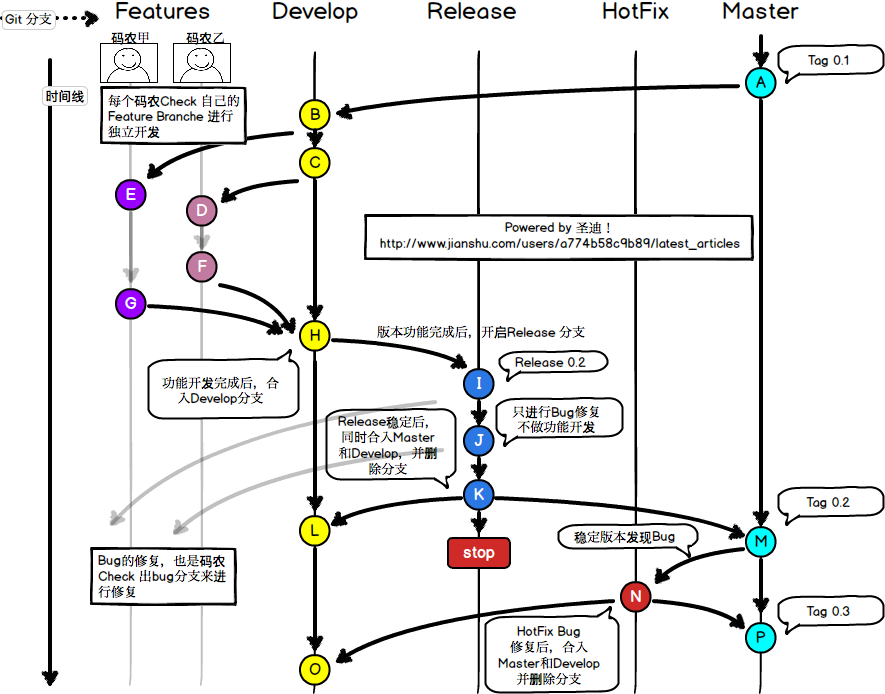

### git开发过程中各个分支的作用简单分析
<!--more-->
Git 和 SVN 是我们代码开发中，最常用的两款代码管理软件。在这里我来写写我在工作中如何使用 Git 来管理我们的代码开发。  
  首先，我们是一个多人开发的团队，因此在开发过程中，少不了要进行多人协作的时候。不同的功能分支就成了家常便饭的事情了。咱先来看一副图：




这幅图里画的是我日常工作中，代码管理中 Git 分支的存在形式。从最上层的一行中可以看到，一般会存在一些这样的分支：

```
>>Master: 主分支；主要是稳定的版本分支，正式发布的版本都从Master拉。
>>Develop: 开发分支；更新和变动最频繁的分支，正常情况下开发都是在Develop分支上进行的。
>>Release：预发行分支；一般来说，代表一个版本的功能全部开发完成后递交测试，测试出Bug后进行修复的分支。
>>Features: 功能分支； 其实Features不是一个分支，而是一个分支文件夹。里面包含了每个程序员开发的功能点。Feature开发完成后合入Develop分支。
>>HotFix: 最希望不会被创建的分支；这个分支的存在是在已经正式上线的版本中，发现了重大Bug进行修复的分支。
```

介绍完了几个分支的主要功能，我们能谈谈一个具体的 App 软件版本开发中的流程。  
1、软件版本的起点：A  
  需求总是在不断更新的。  
  上一次产品经理需求 0.1 的软件版本刚刚完成后，这不又来了新的版本需求 0.2，这次一共两个功能点。幸好我们有 Git，让并行开发成为可能。拉取 Develop 分支准备开干！

2、开发的起点：B  
  两名工程师，两个不同的需求，大师甲和大师乙各自领取一个功能点开干；从 Develop 拉取属于自己的分支，有单独的分支就不会被干扰：）

3、开发的终点：H  
  一周不到，两位大师就已经完成了属于自己的功能；从图上看，都有两次代码的提交。大师们各自开发的功能初步看似乎没有啥问题，但是我们的 App 版本是一个多功能的集合，是否合在一起也会没有问题？这时候大师们把属于自己的分支合入 Develop，并删掉自己的工作 Branche。编译，运行，Success!

4、预发行的起点：Release 0.2 节点 (I)  
  大师们的能力果然与众不同，合入后没有一点问题，达到提交测试部的标准。新建 Release 0.2 分支，代表一个里程碑式的事件。

5、Release 分支 Bug 宿命  
  世上没有哪个大师的代码是没有 Bug 的，大师甲和大师乙也不例外。这不，测试部刚拿到预发行的版本就曝出了 2 个 Bug。  
  不过没有关系，能够复现的 Bug 对于我们来说就不是 Bug。从 Release 0.2 拉取 Bug 修复分支。修好了，继续合进 Release 0.2。谁叫 Release 就是这样的宿命呢。

6、版本发行的终点: M  
  但愿人长久，Bug 不再有。  
  经过大师们艰苦卓绝的 bug 修复，终于通过了测试部的测试，也得到了产品经理们的认可，准备提交 App Store 审核。  
  Release 合入 Master 分支，打上 Tag 0.2，这就是这次的 MileStone 了。  
  当然也得记得 Release 合入 Develop，之前这么多的 bug 也得在 Develop 上修复修复不是。做好了这些，Release 就可以删啦。

7、救火队员一般的 HotFix: N  
  好事多磨！AppStore 刚发出去的 App, 就有用户反馈 Crash! 大师甲和大师乙临危受命!  
  从 Master 拉取 HotFix 分支来搞定它。原来是数组越界！分分钟搞定。完成后合入 Master，版本更新为 Tag 0.3，代表我们修复了重大问题。编译，运行，没问题，提交 App Store 等审核。  
  噢，one more thing, HotFix 也要合入 Develop，又多了一个功能点（bug 修复）不是。

8、新的轮回开始：P  
  1-> 7 就是一个版本的开发过程中，我们的 Git Flow 流。到了最后，P 和 O 节点拥有了相同的内容，就像在一开始的 A 和 B 那样。  
  这时候，我看见产品经理又拿着版本需求 1.0 向我走来......

原文地址 https://www.jianshu.com/p/c2aefcf6b2b7
