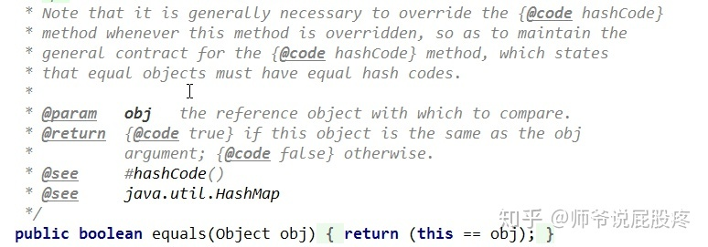
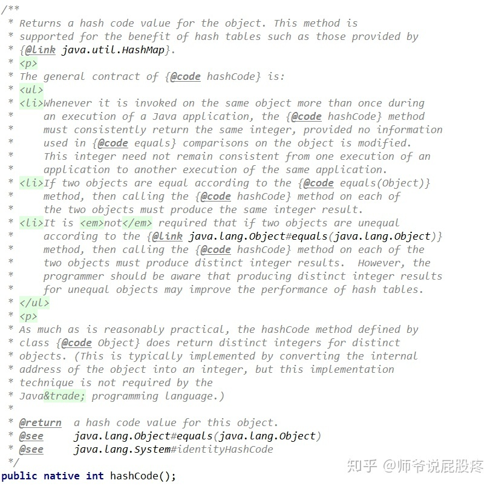
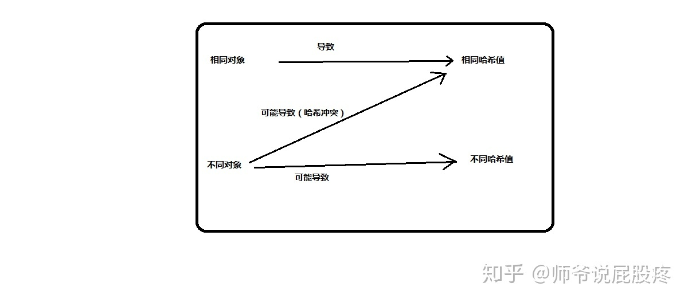
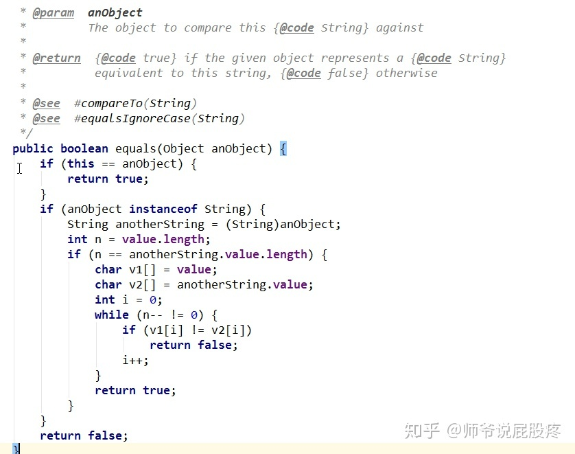
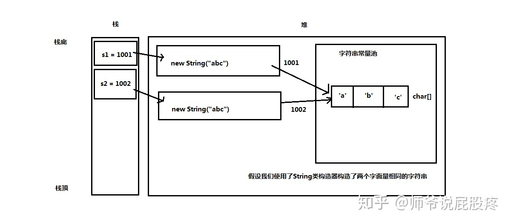

### 为何重写equals方法就得重写hashCode方法
<!--more-->
我们知道，Java 设计的顶级父类 Object 类中，有两个方法很特殊，它们分别是 equals 方法与 hashCode 方法。当我们在使用的时候我们总是被提醒，**一旦重写了 equals 方法，就一定要重写 hashCode 方法**。为什么？很多同学会想这个问题，聊明白这个也就是这篇文章的目的。

在正式探究原因之前，我们先进行前期的铺垫 -- 弄明白这两个方法之间千丝万缕的联系，我们先来看看 Object 这个类的作者是怎么说的，打开 Object 类我们能看到如下注释。

Object 类中 equals 方法

注释中的大致意思是：当我们将 equals 方法重写后有必要将 hashCode 方法也重写，这样做才能保证不违背 hashCode 方法中 “**相同对象必须有相同哈希值**” 的约定。

此处 Object 类的作者只是提醒了我们重写是必要的，重写是为了维护 hashCode 方法设计的定义，**但是为什么要维护 hashCode 方法设计的定义呢**？我们带着疑问继续去看 hashCode 方法的定义。

Object 类中 hashCode 方法

hashCode 方法本质就是一个哈希函数，这个不是我根据字面意思瞎猜的，而是 Object 类的作者说明的。Object 类的作者在注释的最后一段的括号中写道：**将对象的地址值映射为 integer 类型的哈希值。**（对哈希函数定义的一篇文章：[通俗地理解哈希函数](https://zhuanlan.zhihu.com/p/49435564)）。牢牢把握哈希函数的定义有利于帮助我们理解接下来的内容。

我们看到，hashCode 方法注释中列了个列表，列表中有三条注释，当前需要理解的大致意思如下：

1.  一个对象多次调用它的 hashCode 方法，应当返回相同的 integer（哈希值）。
2.  两个对象如果通过 equals 方法判定为相等，那么就应当返回相同 integer。
3.  两个地址值不相等的对象调用 hashCode 方法不要求返回不相等的 integer，但是要求拥有两个不相等 integer 的对象必须是不同对象。

上面列的三条完完全全属于哈希函数的定义与属性范畴。所以我们将上方的三条注释内容代入到哈希函数的定义中帮忙理解。如果还不能理解也可以看下图：

对象与哈希值对应关系

我们看到，图中存在两种独立的情况：

1.  相同的对象必然导致相同的哈希值。
2.  不同的哈希值必然是由不同对象导致的。

也就是作者在 hashCode 方法注释上写明了的定义，实际上作者也就是在实现一个哈希函数，并且把哈希函数的定义写到注释里。

其实我们看到这里，就能明白一件事情了：equals 方法与 hashCode 方法**根本就是配套使用的**。对于任何一个对象，不论是使用继承自 Object 的 equals 方法还是重写 equals 方法。hashCode 方法实际上必须要完成的一件事情就是，**为该 equals 方法认定为相同的对象返回相同的哈希值**。

Object 类中的 equals 方法区分两个对象的做法是比较地址值，即使用 “==”。而我们如若根据业务需求改写了 equals 方法的实现，那么也应当同时改写 hashCode 方法的实现。否则 hashCode 方法依然返回的是依据 Object 类中的依据地址值得到的 integer 哈希值。

这么说起来可能不是很好理解，我们代入到具体的例子 --String 类中好了。

String 类中，equals 方法经过重写，具体实现源码如下：

String 类 equals 方法的重写实现

通过源码我们能看到，String 对象在调用 equals 方法比较另一个对象时，除了认定相同地址值的两个对象相等以外，还认定对应着的每个字符都相等的两个 String 对象也相等，即使这两个 String 对象的地址值不同（即属于两个对象）。

此时我们能想到的是，String 类中对 equals 方法进行重写扩充了，但是如果此时我们不将 hashCode 方法也进行重写，那么 String 类调用的就是来自顶级父类 Obejct 类中的 hashCode 方法。即，对于两个字符串对象，使用他们各自的地址值映射为哈希值。也就是会出现如下情形：

 创建两个地址值不同，字面量相同的字符串对象

也就是说，**被 String 类中的 equals 方法认定为相等的两个对象拥有两个不同的哈希值**（因为他们的地址值不同）。问题分析到这一步，原来的问题 “为什么重写 equals 方法就得重写 hashCode 方法” 已经结束了，它的答案是“**因为必须保证重写后的 equals 方法认定相同的两个对象拥有相同的哈希值**”。同时我们顺便得出了一个结论：“**hashCode 方法的重写原则就是保证 equals 方法认定为相同的两个对象拥有相同的哈希值**”。

看到这里，我的内心甚至没有一点波澜 -- 两个字面量相同的 String 对象哈希值不同怎么啦！Object 类作者给我的叮嘱我不遵守又怎么啦！说到现在为止，上方提到的任何东西都没有对我的实际代码没有造成任何影响。实际上是这样吗？**两个被认定为相同的对象拥有不同的哈希值没有造成不便或者 bug 吗**？这就是我们接下来要进一步挖掘的问题：**为什么要保证它们的哈希值相等呢？“hashCode 方法返回的哈希值在语言中扮演了一个什么角色？**”。

其实，文章前半部在分析 Java 作者注释的时候我省去了一些东西没有说明，就是作者几次三番地提到了 HashMap、HashTable。所以接下来我们带着疑问接着看 HashMap 类中存放数据的 put 方法，它实际调用 putVal 方法，以下是它的片段截取：

put 一个键值对的时候按照流程大致进行了如下操作：

1.  通过传入键（Key）的哈希值来查找底层数组位于该位置的元素 p，如果 p 不为 null，则相当于我们传入的 Key 在 HashMap 的底层数组中存在。也就是说我们需要使用新的键值对来覆盖旧的键值对（0 号红框处）。
2.  仅仅是通过哈希值相等来证明两个对象是相同对象是行不通的，因此我们再做进一步的证明，即上图 1、2 号红框中，为了证明两个对象是同一对象，我们要求 (二者哈希值相等) 且(二者地址值相等或调用 equals 认定相等)。
3.  如果底层数组中存在传入的 Key，那么使用新传入的覆盖掉查到的（3 号红框处）。

注意！这一整套流程出现问题了。结合上文，假设此处我们此处我们使用了 String 类型的值来作为 Key 值，且此 String 类重写了 equals 方法而未重写 hashCode 方法。

那么还是那个地址值不同而字面量相同的两个 String 对象 s1 与 s2，由于未进行针对性地重写 hashCode 方法，那么 hashCode 还是通过地址值分别得到 s1 与 s2 的哈希值，他们显然是不同的。

0 号红色框中的 hash 是传入 Key 的哈希值，它与 HashMap 底层数组 tab 的长度进行同位与运算得到的数组位置为最终目标节点在数组中的位置。也就是说即使我们输入了两个字面量完全相同的 s1 与 s2，由于他们的地址值不同，得到的哈希值也不同，结果导致的是这个查出来的 p 节点始终为 null（0 号红色框处），也就是会执行操作 -- 创建一个新的节点。

对应到我们 put 操作就相当于执行了 hashMap.put("k","v1")，hashMap.put("k":"v2")，而不是使用 v2 替换 v1 的值，这样我们的 HashMap 就乱套了。

虽然此处我们仅仅是进行了十分简陋且十分片面的证明，但是问题挖到了这里依然说明了相同对象拥有不同哈希值会造成不便。几乎可以肯定地说，**hashCode 方法不仅仅是与 equals 配套使用的，它甚至是与 Java 集合配套使用的**。同样地，类似的代码我们也能在 HashTable 中找到，就更不用提 HashSet 一类的集合了。

集合本身在我们日常的编码中就必不可少，所以我们以后为了代码不出问题还是乖乖地重写 hashCode 方法吧。不过好在一般我们为了集合的效率以及安全性，都会使用不可变的 String，它已经将 hashCode 方法重写了，并且重写的是一个散列极为优秀的 hashCode 方法，此处限于篇幅不展开聊。（END）

写下你的评论...  

为啥重写 equals？

继承自 Object 的 equals 方法不能满足业务需求的情形，就比如我在文中说的，String 除了对比地址值之外，还将每个对应字符相等的两个 String 对象也认定为 “equals”。

什么样的业务需求会是这样的情况？？

"String 类中对 equals 方法进行重写扩充了，但是如果此时我们不将 hashCode 方法也进行重写，那么 String 类调用的就是来自顶级父类 Obejct 类中的 hashCode 方法。"

String 调用 Hashcode 方法的 case，你是指下文 java API 的 hash 有关的集合吧，因为它们默认调用了 Hashcode 方法？

这里单独拿出 String 类来说是为了下文直观地说明如果不重写会给实际代码造成什么后果，毕竟集合的使用是日常代码离不开的，并且我们大多数时候都选择 String 作 key。

那可以理解为 非要重写 hashcode 的根本原因 就是这些 hash 结构 是默认调用 hashcode

来计算 key 的？

原文地址 https://zhuanlan.zhihu.com/p/50206657
