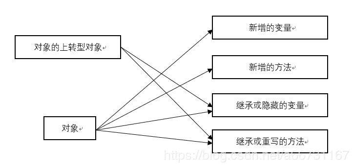

### 关于 java 多态性之父类引用指向子类对象
<!--more-->
在使用多态前，要确保两个类之间是继承关系

```
public class Animal{

}

public class Dog extends Animal{

}
```

之后创建对象：

```
Animal animal1 = new Animal();
Animal animal2 = new Dog();
```

这时，Animal animal2 = new Dog(); 就是父类引用指向子类对象

即：**声明的是父类，实际指向的是子类的一个对象**

在学习 java 时，书上有讲到一个章节——对象的上转对象，其中有一个概念：

A 类是 B 类的父类，当用子类创建一个对象，并把这个对象的引用放到父类的对象时，

```
A a;
a = new B();    //A a = new B();
//或者
A a;
B b=new B();
a=b;
```

这时，称对象 a 是对象 b 的**上转对象**（就像说 “中国人是人”）

可以理解成，父类引用指向子类对象 = 上转对象  （不确定，我是暂时这么理解）

那么，让父类引用指向子类对象有什么用的：

要知道，**_父类对象不可以访问，子类方法_**。

而上转型对象，既可以访问父类方法（通过 super. 来调用），也可以访问子类继承或隐藏的成员变量，或者调用子类继承的方法（父类方法）或者子类重写的实例方法。



进而，一个父类类型的引用指向一个子类的对象既可以使用子类强大的功能，又可以抽取父类的共性。

一个参考网上的定义：要做到父类引用调用子类的属性或者方法，就还要有**动态连接**。那什么是动态链接呢？**当父类中的一个方法只有在父类中定义而在子类中没有被重写的情况下，才可以被父类类型的引用调用； 对于父类中定义的方法，如果子类中重写了该方法，那么父类类型的引用将会调用子类中的这个方法，这就是动态连接。**

JAVA 里没有多继承，一个类只能有一个父类。而继承的表现就是多态。一个父类可以有多个子类，而在子类里可以重写父类的方法，这样每个子类里重写的代码不一样，自然表现形式就不一样。这样用父类的变量去引用不同的子类，在调用这个相同的方法的时候得到的结果和表现形式就不一样了，这就是多态，相同的消息（也就是调用相同的方法）会有不同的结果。举例说明：  
下面看一个多态性的例子：

```
//父类
public class Animal{
    //动物会叫
   public void shout(){
  }
}

//子类：狗
public class Dog extends Animal{
   //狗的叫声
   public void shout(){
   System.out.println("汪汪汪！");
  }
}

//子类：猫
public class Cat extends Animal{
   //猫的叫声
   public void shout(){
   System.out.println("喵喵喵！");
  }
}

//子类：狼
public class Wolf extends Animal{
    //虎的叫声
    public void shout(){
    System.out.println("嗷呜嗷呜！");
   }
}

//测试类
public class Test{
    public static void main(String arg[]){
       Animal animal;
       animal = new Dog();
       animal.shout();
       animal = new Cat();
       animal.shout();
       animal = new Wolf();
       animal.shout();
      }
}
```
 参考博客：[https://www.cnblogs.com/shilin/p/4784862.html](https://www.cnblogs.com/shilin/p/4784862.html)
