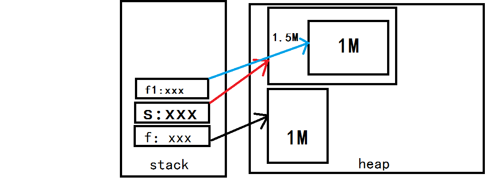

### 多态性，父类引用指向子类对象
<!--more-->
父类引用指向子类对象指的是：

例如父类 Animal，子类 Cat,Dog。其中 Animal 可以是类也可以是接口，Cat 和 Dog 是继承或实现 Animal 的子类。

Animal animal = new Cat();  
即声明的是父类，实际指向的是子类的一个对象。

**那我们从内存角度来理解试试.**  
假设现在有一个父类 Father, 它里面的变量需要占用 1M 内存.  
有一个它的子类 Son, 它里面的变量需要占用 0.5M 内存.  
现在通过代码来看看内存的分配情况:

```
Father f = new Father();//系统将分配1M内存.
```

```
Son s = new Son();//系统将分配1.5M内存!
```

因为子类中有一个隐藏的引用 super 会指向父类实例, 所以在实例化子类之前会先实例化一个父类, 也就是说会先执行父类的构造函数. 由于 s 中包含了父类的实例, 所以 s 可以调用父类的方法.

```
Son s1 = s; //s1指向那1.5M的内存.
```

```
Father f1 = (Father)s;//这时f1会指向那1.5M内存中的1M内存
```

f1 只是指向了 s 中实例的父类实例对象, 所以 f1 只能调用父类的方法 (存储在 1M 内存中), 而不能调用子类的方法 (存储在 0.5M 内存中).

```
Son s2 = (Son)f;//这句代码运行时会报ClassCastException.
```

因为 f 中只有 1M 内存, 而子类的引用都必须要有 1.5M 的内存, 所以无法转换.

```
Son s3 = (Son)f1;//这句可以通过运行,这时s3指向那1.5M的内存.
```

由于 f1 是由 s 转换过来的, 所以它是有 1.5M 的内存的, 只是它指向的只有 1M 内存.  


如果能够理解对象在内存的分布，那我们接下来就介绍 java 的多态性

方法的重写、重载和动态链接构成了 java 的多态性。Java 之所以引入多态的概念，原因之一是它在类的继承问题上和 C++ 不同，后者允许多继承，这确实给其带来的非常强大的功能，但是复杂的继承关系也给 C++ 开发者带来了更大的麻烦，为了规避风险，Java 只允许单继承，派生类与基类间有 IS-A 的关系（即 “猫”is a “动物”）。这样做虽然保证了继承关系的简单明了，但是势必在功能上有很大的限制，所以，Java 引入了多态性的概念以弥补这点的不足。

理解多态性，首先要理解的就是 “向上转型”

Animal c = new Cat()；  
它表示我定义了一个 Animal 类型的引用，指向新建的 Cat 类型的对象。由于 Cat 是继承自它的父类 Animal，所以 Animal 类型的引用是可以指向 Cat 类型的对象的。这就是 “向上转型”。

注意：java 中 “向上转型” 是自动的。但是 “向下转型” 却不是自动的。需要我们用强制类型转化。

```
Animal c = new Cat();
Cat c1 = （Cat）c；    //不允许“向下转型”，需用强制类型转化。
```

那么这样做有什么意义呢？因为子类是对父类的改进和扩充。定义一个父类类型的引用指向一个子类的对象既可以使用子类强大的功能，又可以抽取父类的共性。 但是父类类型的引用可以调用父类中定义的所有属性和方法，而对于子类中定义而父类中没有的方法，父类引用是无法调用的；

要做到父类引用调用子类的属性或者方法，就还要有**动态连接**。那什么是动态链接呢？**当父类中的一个方法只有在父类中定义而在子类中没有被重写的情况下，才可以被父类类型的引用调用； 对于父类中定义的方法，如果子类中重写了该方法，那么父类类型的引用将会调用子类中的这个方法，这就是动态连接。**

JAVA 里没有多继承，一个类只能有一个父类。而继承的表现就是多态。一个父类可以有多个子类，而在子类里可以重写父类的方法，这样每个子类里重写的代码不一样，自然表现形式就不一样。这样用父类的变量去引用不同的子类，在调用这个相同的方法的时候得到的结果和表现形式就不一样了，这就是多态，相同的消息（也就是调用相同的方法）会有不同的结果。举例说明：  
下面看一个多态性的例子

```
//父类
public class Father{
    //父类有一个打孩子方法
    public void hitChild(){
    }
}
//子类1
public class Son1 extends Father{
    //重写父类打孩子方法
    public void hitChild(){
      System.out.println("为什么打我？我做错什么了！");
    }
}
//子类2
public class Son2 extends Father{
    //重写父类打孩子方法
    public void hitChild(){
      System.out.println("我知道错了，别打了！");
    }
}
//子类3
public class Son3 extends Father{
    //重写父类打孩子方法
    public void hitChild(){
      System.out.println("我跑，你打不着！");
    }
}
//测试类
public class Test{
    public static void main(String args[]){
      Father father;
      father = new Son1();
      father.hitChild();
      father = new Son2();
      father.hitChild();
      father = new Son3();
      father.hitChild();
    }
}
```

上面程序调用同一个方法，去出现不同的结果。这就是多态。  
对于多态性的实现有必要重视方法重载（overloading）和方法重写（override）区别

```
class Father{
    public void func1(){
       System.out.println("AAA");
    }
}

class Child extends Father{
    //func1(int i)是对func1()方法的一个重载，主要不是重写！
    //由于在父类中没有定义这个方法，所以它不能被父类类型的引用调用
    //所以在下面的main方法中child.func1(68)是不对的
    public void func1(int i){
        System.out.println("BBB");
    }  
}

public class PolymorphismTest {
    public static void main(String[] args) { 
        Father child = new Child();
        child.func1(68);//错误
    }
}
```

上面的程序是个很典型的多态的例子。子类 Child 继承了父类 Father，并重载了父类的 func1() 方法。重载后的 func1(int i) 和 func1() 不再是同一个方法，由于父类中没有 func1(int i)，那么，父类类型的引用 child 就不能调用 func1(int i) 方法。

**最后，对于多态做出几点总结**

**1、使用父类类型的引用指向子类的对象；**  
**2、该引用只能调用父类中定义的方法和变量；**  
**3、如果子类中重写了父类中的一个方法，那么在调用这个方法的时候，将会调用子类中的这个方法；（动态连接、动态调用）**  
**4、变量不能被重写（覆盖），”重写 “的概念只针对方法，如果在子类中” 重写“了父类中的变量，那么在编译时会报错。**
